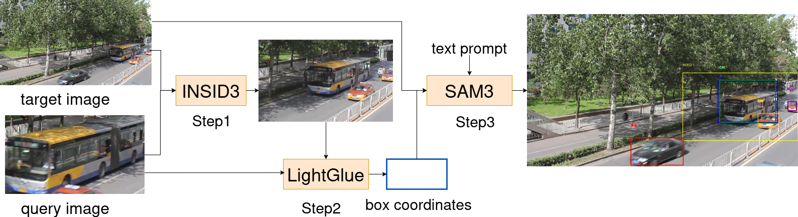

# Example-Based Object Detection (EBOD)

Official implementation of **Example-Based Object Detection** - a training-free framework that leverages historical false positive and false negative examples to improve detection robustness without model retraining.

## Overview

EBOD integrates three powerful models to prevent repeated detection errors:
- **INSID3**: Generates candidate regions using DINOv3 features
- **LightGlue**: Performs precise instance-level feature matching
- **SAM3**: Produces final detection results with box and text prompts



## Key Features

✅ **Training-free**: No additional model training required  
✅ **Error correction**: Leverages false positive/negative examples  
✅ **Cross-image transfer**: Transfers object information across different viewpoints  
✅ **Low cost**: Significantly reduces human effort and computational resources  

## Usage

After setting up the Python environment and downloading the required model weights, 
run:
```bash
python run_demo.py
```

## Citation

If you find this work useful, please cite:

```bibtex
@misc{sun2026examplebasedobjectdetection,
      title={Example-Based Object Detection}, 
      author={ZhiXin Sun},
      year={2026},
      eprint={2605.04501},
      archivePrefix={arXiv},
      primaryClass={cs.CV},
      url={https://arxiv.org/abs/2605.04501}, 
}
```

## License

This project incorporates multiple components with different licenses. Please refer to individual license files for details.
